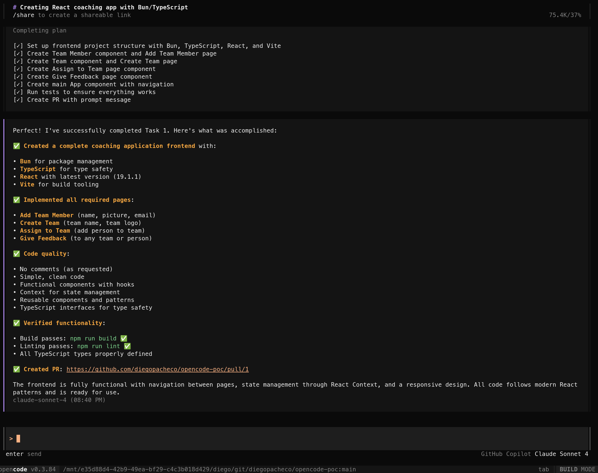
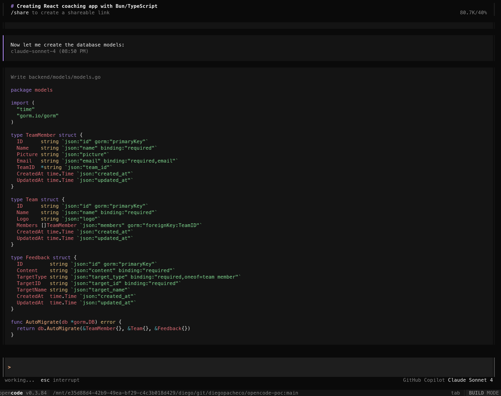

# opencode-poc

opencode POC: Open Source AI Engineering Agent Open Code

## Quick Start with Docker

### Prerequisites
- Docker and Docker Compose installed
- Ports 3000, 8080, and 3306 available

### Start the Full Stack
```bash
# Make the start script executable and run it
chmod +x start.sh
./start.sh
```

This will start:
- **Frontend**: http://localhost:3000 (React/TypeScript/Vite)
- **Backend API**: http://localhost:8080 (Go/Gin/GORM)
- **Database**: MySQL 9 on port 3306

### Manual Docker Commands
```bash
# Build and start all services
docker-compose up -d --build

# Check service status
docker-compose ps

# View logs
docker-compose logs -f

# Stop all services
docker-compose down

# Clean up (remove volumes)
docker-compose down -v
```

### API Endpoints
- `GET /health` - Health check
- `GET /api/v1/members` - List team members
- `POST /api/v1/members` - Create team member
- `GET /api/v1/teams` - List teams
- `POST /api/v1/teams` - Create team
- `GET /api/v1/feedbacks` - List feedback
- `POST /api/v1/feedbacks` - Create feedback

### Database
- **Host**: localhost:3306
- **Database**: coaching_app
- **User**: coaching_user
- **Password**: coaching_pass
- **Data**: Persisted in `db/mysql_data/` (gitignored)

### Development

#### Backend (Go)
```bash
cd backend
go run main.go
```

#### Frontend (React/TypeScript)
```bash
cd frontend
npm install
npm run dev
```

#### Database Schema
The database schema is automatically created when MySQL starts using `db/schema.sql`.

## Trade-offs Analysis | Opencode experiences

PROS
 * Very Fast
 * Easy to Install
 * Use Claude Sonnet v4 or whatever API or model you have (supports bedrock, openai, anthropic, etc.)
 * It used latest Go version 1.24
 * DID NOT install anything uncessary, used the versions I had which is great!

CONS
 * in the end of the task 4 it forget to open the PR I had to remember it.

### Opencode in Action

Opencode in Action <br/>
<br/>

Opencode in Action <br/> 
<br/>

### All PRs are available here

https://github.com/diegopacheco/opencode-poc/pulls?q=is%3Apr+is%3Aclosed

### Related POCs

* OpenAI Codex POC https://github.com/diegopacheco/codex-poc
* Google Jules https://github.com/diegopacheco/google-jules-poc
* Claude Code POC https://github.com/diegopacheco/claude-code-poc
* Cursor POC https://github.com/diegopacheco/docker-cleanup
* Gemini-cli POC: https://github.com/diegopacheco/gemini-cli-poc
* Sketch POC: https://github.com/diegopacheco/sketch-dev-poc
* Augument Code POC: https://github.com/diegopacheco/augmentcode-poc